# JBoss EAP On Azure App Service Demo

|              AGENDA               |   
|------------------------------------|
| 1. JBoss EAP App Service 만들기      |
|  - GitHub 프로젝트 생성             |  
|  - Azure Portal 접속    |  
|  - App Service 생성            |  
|  - 배포 생성                 |  
| 2. JBoss EAP Datasource 연동하기  |
|  - MySQL Azure Database 생성         |
|  - JBoss Datasource 설정하기             | 
|  - 컨테이너 환경 변수 사용하기           | 
|  - 어플리케이션 배포 & 환경변수 사용하기     |        | 
| 3.  DevOps 배포 전략 (Blue-Green Deployment) |  
|  - Blue-Green 배포            |  
|  - Canary 배포                |  

> ## Azure App Service
> Azure App Service 는 웹 애플리케이션, REST API 및 모바일 백 엔드를 호스트하는 HTTP 기반 서비스입니다. .NET, .NET Core, Java, Ruby, Node.js, PHP 또는 Python 등 원하는 언어로 개발할 수 있습니다. Windows 및 Linux 기반 환경에서 애플리케이션을 쉽게 실행하고 확장할 수 있습니다. <BR>
> App Service는 보안, 부하 분산, 자동 크기 조정 및 자동화된 관리와 같이 Microsoft Azure의 강력한 기능을 애플리케이션에 추가합니다. 또한 Azure DevOps, GitHub, Docker 허브 및 기타 원본, 패키지 관리, 스테이징 환경, 사용자 지정 도메인 및 TLS/SSL 인증서의 지속적인 배포와 같은 DevOps 기능도 활용할 수 있습니다. <BR>
>> https://docs.microsoft.com/ko-kr/azure/app-service/overview

> ## JBoss EAP
> JBoss EAP 7은 배포를 단순화하고 모든 환경에서 애플리케이션의 Jakarta EE 성능을 최적화하도록 설계되었습니다. 온프레미스 환경이나 가상 환경 또는 프라이빗, 퍼블릭, 하이브리드 클라우드 환경 등 모든 환경에서 JBoss EAP는 필요한 경우에만 서비스를 시작하는 모듈형 아키텍처를 제공합니다. 매우 작은 메모리 크기와 빠른 시작 시간이 특징인 JBoss EAP는 Red Hat OpenShift와 같이 효율적인 리소스 활용이 가장 중요한 환경에 적합합니다. <BR>
>> https://www.redhat.com/ko/technologies/jboss-middleware/application-platform/features

> ## Spring Boot
> 스프링부트는 최소한의 설정으로 쉽게 프로덕션 레벨의 어플리케이션을 만들수 있는 최적화된 프레임워크입니다. 스프링 부트는 환경 설정을 최소화하고 개발자가 비즈니스 로직에 집중할 수 있게하여 생산성을 크게 향상시켜줍니다.
>> https://spring.io/projects/spring-boot

---

## 1. JBoss EAP App Service 만들기
### 1.1. GitHub 프로젝트 생성

데모에 사용될 어플리케이션을 자신의 github repository 로 fork 합니다.

github 로그인후 샘플 Spring Boot 프로젝트인 Jpetstore items API 프로젝트를 Fork합니다. <BR>
https://github.com/nationminu/jpetstore-sample.git > Fork
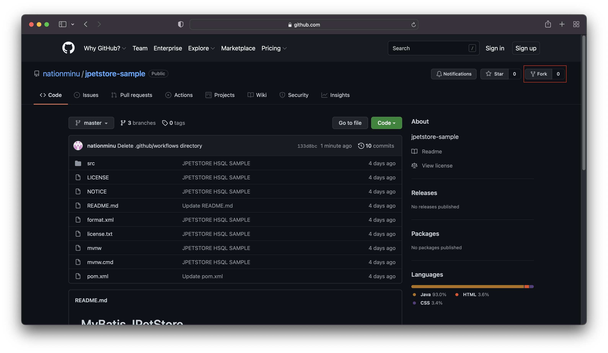

두번쨰 Blue/Green Deployment 샘플 프로젝트를 Fork합니다. <BR>
https://github.com/nationminu/bluegreen-springboot.git > Fork
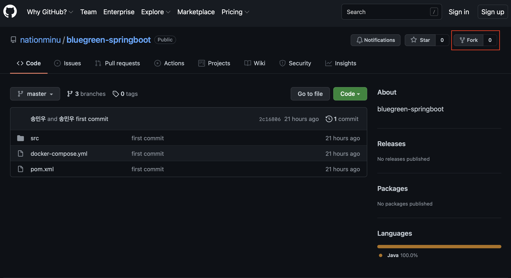
 
### 1.2. Azure Portal 접속

> https://portal.azure.com 접속 > App Services 이동 > Create ->
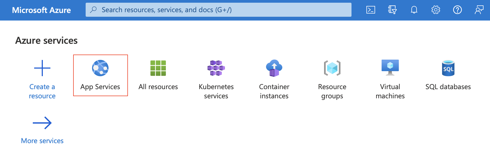

### 1.3. App Service 생성

JBoss EAP 를 사용하는 App Services 를 생성합니다.

App Services Create ->  
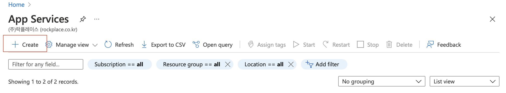

필수 사항 입력 -> 추가설정(배포,모니터링,태그)생략 ->

| 설정  | 설정값 |
|------|--------|
| 스택  | Java | 
| 코드  | Java 8 |
| Java 웹서버 | JBoss EAP |
| 지역  | Korea Central | 

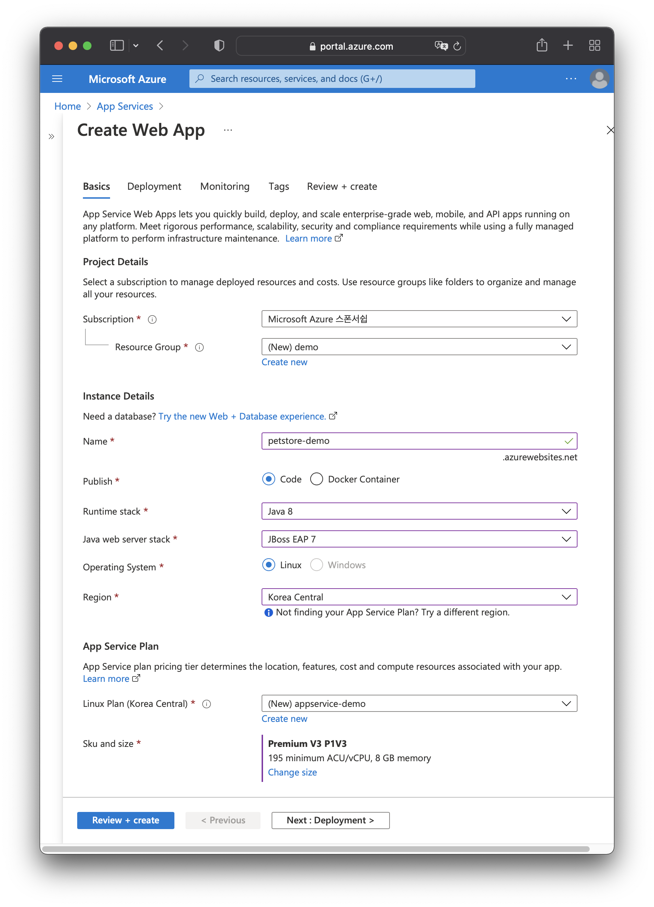

서비스 리소스 생성 확인 -> 
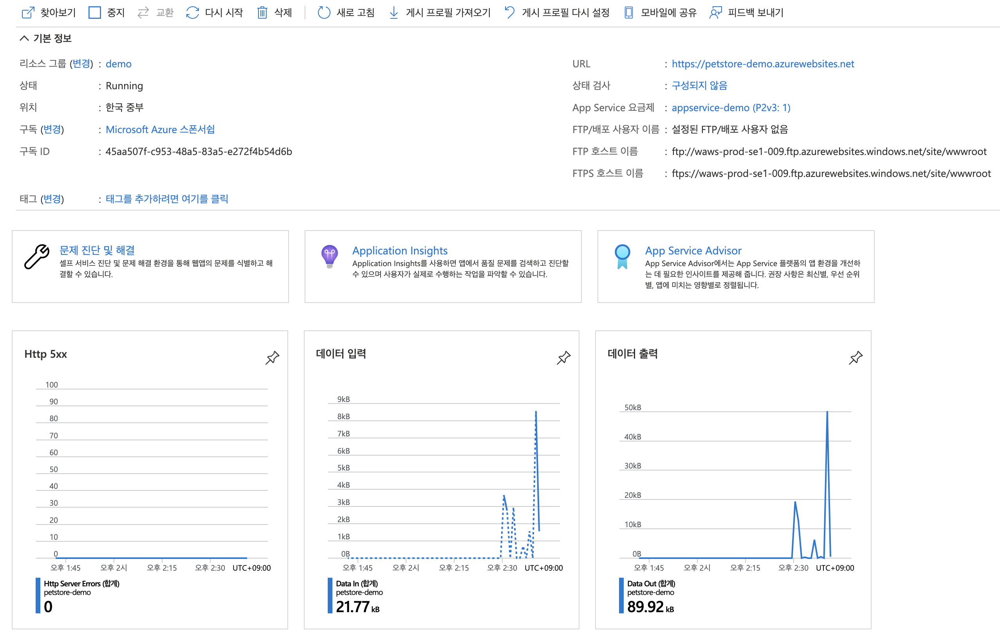
 
### 1.4. 배포 생성

어플리케이션을 배포하기 위한 배포 설정을 진행합니다.

배포 -> 배포 센터 -> 
| 설정  | 설정값 |
|------|--------|
| 소스  | GitHub | 
| 조직  | GitHub 계정명 | 
| 리포지토리 | GitHub 소스리포지토리 |
| 분기  | branch | 

서비스 리소스 생성 확인 -> 
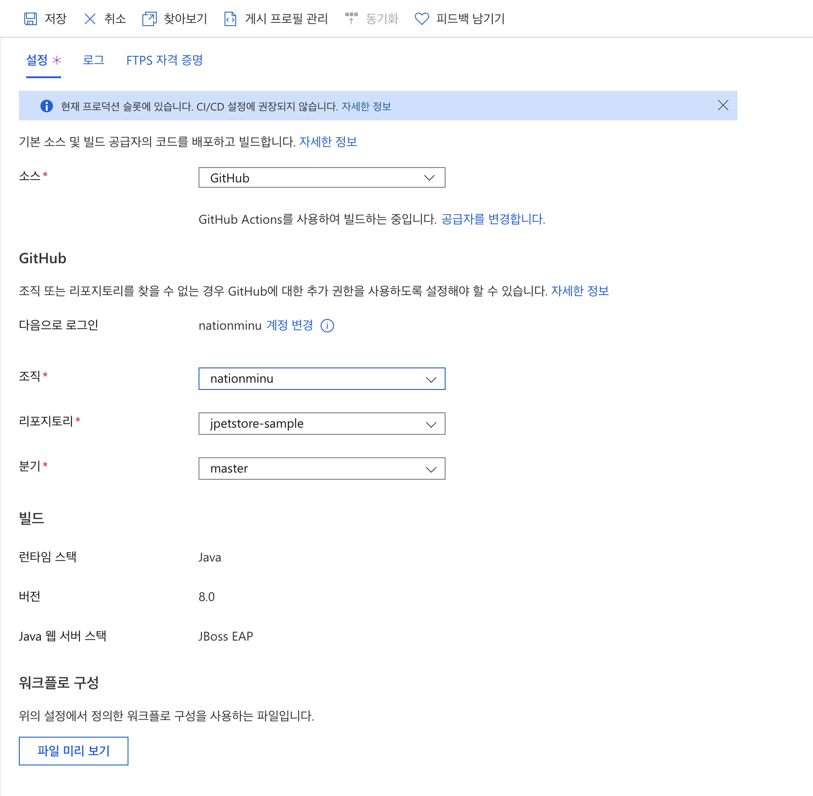

배포 > 배포 센터 > 로그
Github action 의 파이프라인 형태의 로그 확인이 가능
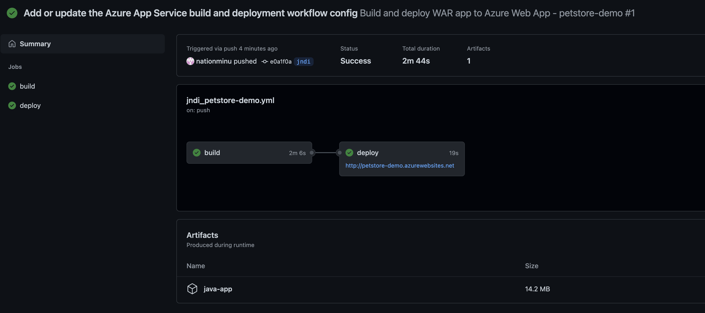

---
## 2. JBoss EAP Datasource 연동하기
### 2.1. MySQL Azure Database 생성

서비스 만들기 -> Azure Database for MySQL -> 단일서버 -> 기본정보입력 -> 만들기
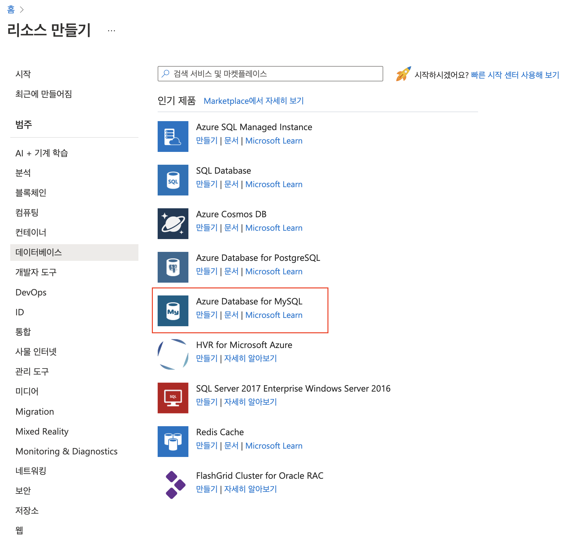
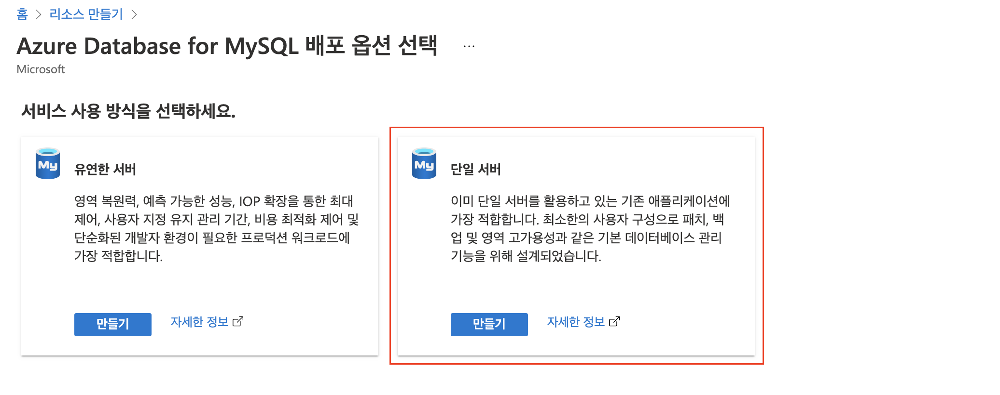
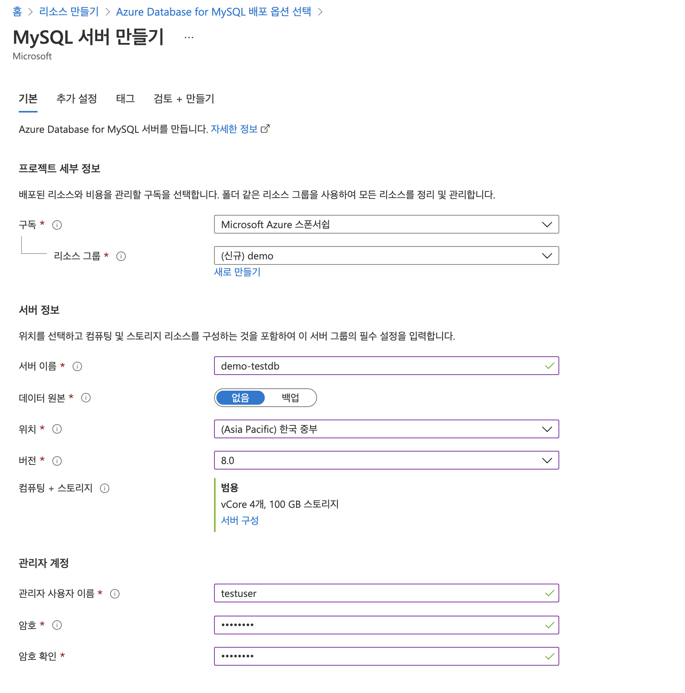

네트워크 보안 설정 -> 
- 연결 보안 > 퍼블릭 네트워크 액세스 거부 (아니요) > Azure 서비스 방문 허용 (예)
- 방화벽 규칙에 현재 사용 IP 등록
- SSL 연결 적용 (사용 안함)

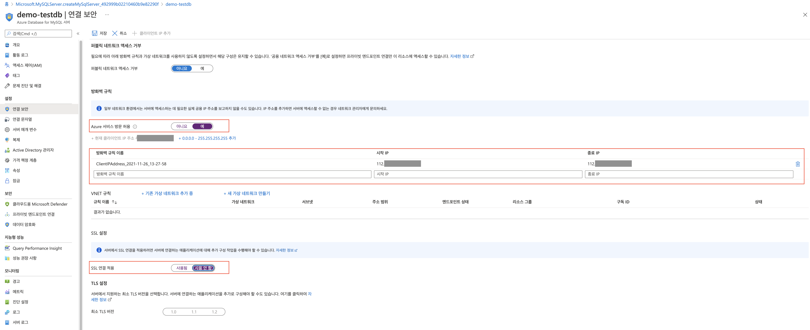

개요 -> JDBC 연결에 사용.
- 서버 이름 확인 : demo-testdb.mysql.database.azure.com
- 서버 사용자 이름 : testuser@demo-testdb
- 서비 비밀 번호 : ******(초기설정 비밀번호)

JDBC 연결 URL -> 연결 문자열

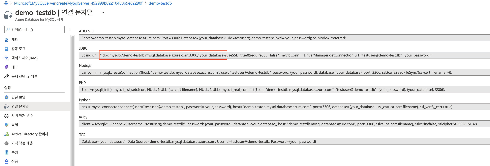

연결 테스트 -> MySQL Workbench 사용


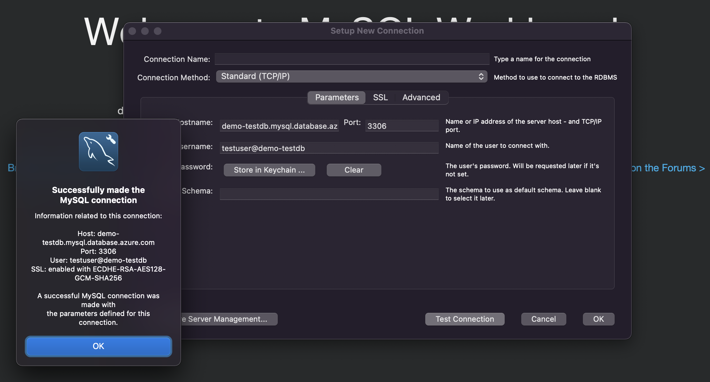

### 2.2. JBoss Datasource 설정하기

> Azure App Service 에서는 JBoss EAP 기동시 JBoss CLI 스크립트를 사용해 Datasource 를 추가 할 수 있다.

스크립트 작성
1. 모듈 구성
```
> tree
.
└── com
    └── mysql
        └── main
            ├── module.xml
            └── mysql-connector-java-8.0.26.jar

- module.xml

<?xml version="1.0" encoding="UTF-8"?>
<module xmlns="urn:jboss:module:1.1" name="com.mysql">
	<resources>
		<resource-root path="mysql-connector-java-8.0.26.jar" />
	</resources>
	<dependencies>
		<module name="javaee.api"/> 
		<module name="javax.api"/>
		<module name="javax.transaction.api"/>
	</dependencies>
</module>
```
2. CLI 스크립트 작성
```
#!/usr/bin/env bash

# Add the JDBC Driver as a Core Module
module add --name=com.mysql --resources=/home/site/deployments/tools/module/com/mysql/main/mysql-connector-java-8.0.26.jar --module-xml=/home/site/deployments/tools/module/com/mysql/main/module.xml --dependencies=javaee.api,javax.api,javax.transaction.api

# Register the JDBC Driver
/subsystem=datasources/jdbc-driver=mysql:add(driver-name=mysql,driver-module-name=com.mysql,driver-xa-datasource-class-name=com.mysql.cj.jdbc.MysqlXADataSource, driver-class-name=com.mysql.cj.jdbc.Driver)

# Add datasource
data-source add --name=mysqlDS --jndi-name=java:/jboss/mysqlDS --driver-name=mysql --connection-url=jdbc:mysql://rpdb.mysql.database.azure.com:3306/petstore?autoReconnect=true --user-name=petstore@rpdb --password=test!234
```

3. 시작 스크립트 작성
```
$JBOSS_HOME/bin/jboss-cli.sh --connect --file=/home/site/deployments/tools/jboss-cli-commands.cli
```

4. 배포 > 배포 센터 > FTPS 자격 증명
FTP 정보 확인후 

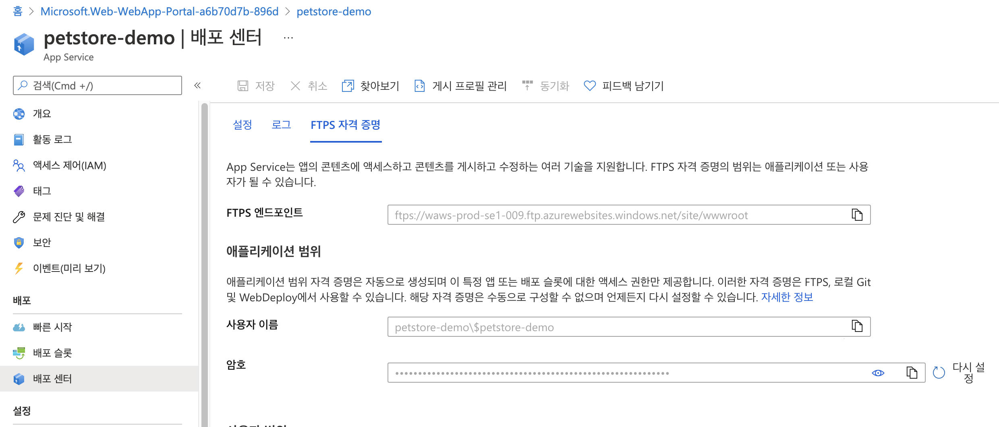

FTP를 사용하여 /home/site/deployments/tools/ 생성한 모든 파일 업로드

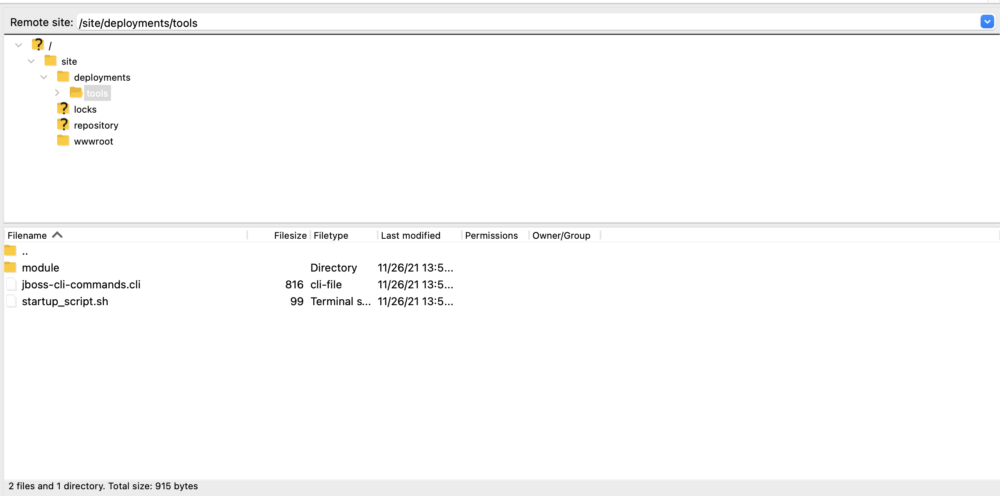

5. 설정 > 구성 > 일반 설정 > 시작 명령
/home/site/deployments/tools/startup_script.sh 등록 > 저장

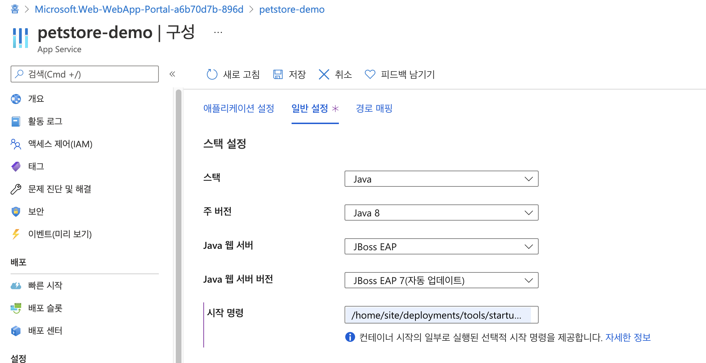
 

### 2.3. 컨테이너 환경 변수 사용하기 
JAVA_OPTS 환경 변수 등록 : -DDB_JNDI=java:/jboss/mysqlDS
스프링 설정에서 환경 변수 확인
src/main/webapp/WEB-INF/applicationContext.xml
```
	<!--  jndi lookup  -->
	<bean id="dataSource" class="org.springframework.jndi.JndiObjectFactoryBean">
	    <property name="jndiName" value="#{systemProperties['DB_JNDI'] ?: 'java:comp/env/jdbc/mydb'}"/>
	</bean>
```
설정 > 구성 > 일반 설정 > 애플리케이션 설정

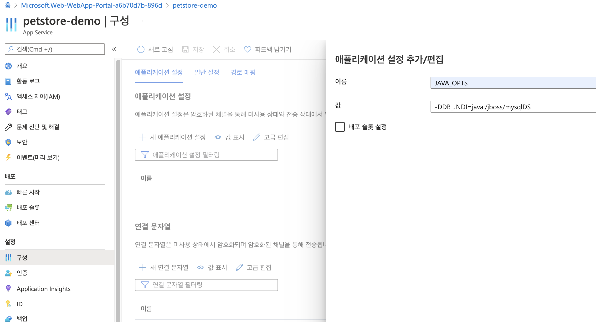

### 2.4. 어플리케이션 배포 & 환경변수 사용하기 

JDNI 를 사용하는 샘플 어플리케이션을 배포한다
https://github.com/nationminu/jpetstore-sample.git > jndi 브랜치 사용

> 컨테이너의 환경 변수 JAVA_OPTS 의 DB_JNDI 값을 사용하여 디비 연결을 시도한다.

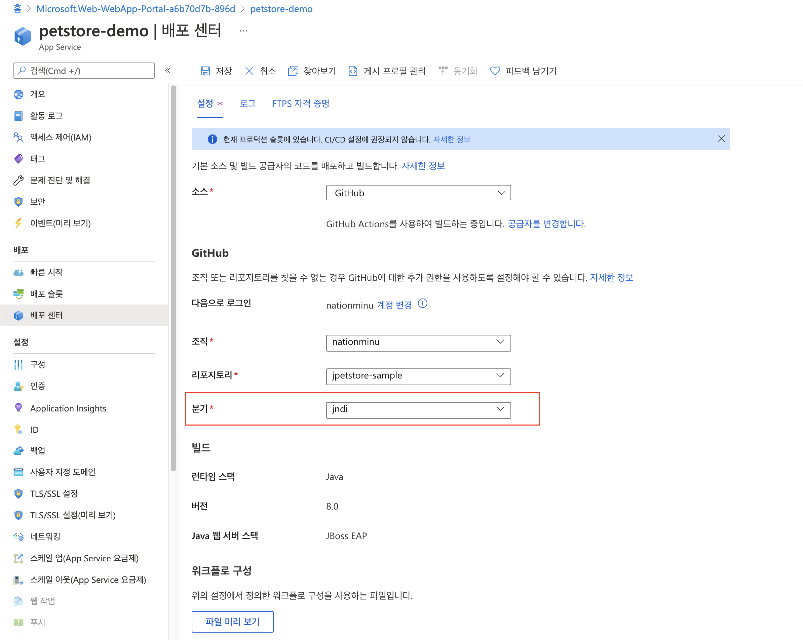

DBCP 의 경우도 동일하게 환경 변수로 사용 가능하다.
https://github.com/nationminu/jpetstore-sample.git > dbcp2 브랜치 사용
```
JAVA_OPTS="-DDB_CLASS=com.mysql.cj.jdbc.Driver -DDB_URL='jdbc:mysql://hostname:3306/petstore' -DDB_USERNAME=petstore -DDB_PASSWORD=petstore"
```

---
## 3. DevOps 배포 전략

> 새로운 App Service 를 생성하고 Springboot 샘플어플리케이션 배포.

### 3.1. Blue-Green 배포

> 새로운 App Service 를 생성하고 배포 슬롯(staging)을 추가한다.

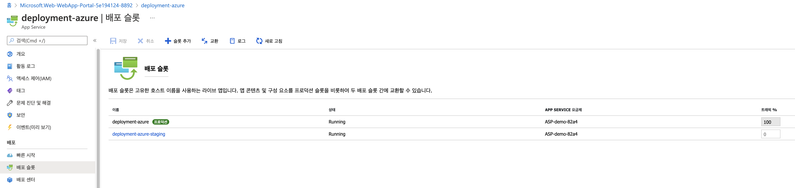

> production 슬롯은 blue branch 를 배포.
https://blue-app/hello
```
{"app":"blue","timeElapsed":0,"hostname":"a23f0d8297cc","ip":"169.254.130.2","version":"2.0","pageCode":"0002"}
```

> staging 슬롯은 green branch 를 배포.
https://green-app/hello
```
{"app":"green","timeElapsed":0,"hostname":"e36576f0efb8","ip":"169.254.131.4","version":"3.0","pageCode":"0002"}
```

> 배포 > 배포 슬롯 > 전환 
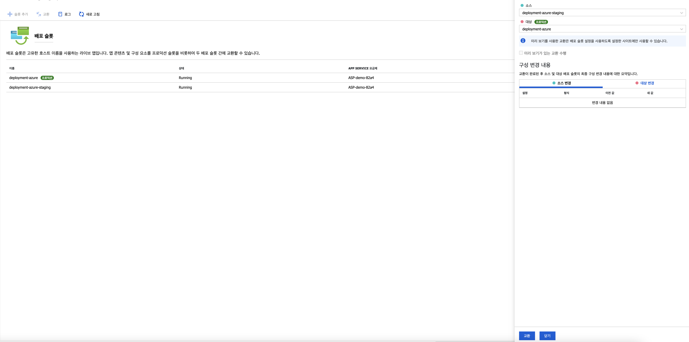

> 전환이후 어플리케이션 버전을 확인
```
{"app":"green","timeElapsed":0,"hostname":"e36576f0efb8","ip":"169.254.131.4","version":"3.0","pageCode":"0002"}
```

### 3.2. Canary 배포 

> 배포 > 배포 슬롯 > 트래픽(%) 조절 
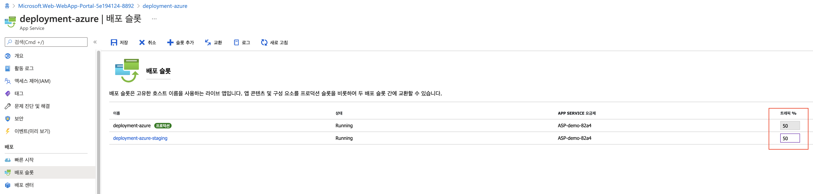

> Curl 명령어로 10번 수행시 버전별로 분배되어 접속(브라우저 요청시 stikcy 로 인해 최초 접속 버전으로 유지됨)
```
for i in {1..10}
for> do
for> curl https://blue-app/hello
for> echo ""
for> done
{"app":"green","timeElapsed":1,"hostname":"e36576f0efb8","ip":"169.254.131.4","version":"3.0","pageCode":"0002"}
{"app":"green","timeElapsed":1,"hostname":"e36576f0efb8","ip":"169.254.131.4","version":"3.0","pageCode":"0002"}
{"app":"blue","timeElapsed":0,"hostname":"a23f0d8297cc","ip":"169.254.130.2","version":"2.0","pageCode":"0002"}
{"app":"blue","timeElapsed":1,"hostname":"a23f0d8297cc","ip":"169.254.130.2","version":"2.0","pageCode":"0002"}
{"app":"blue","timeElapsed":0,"hostname":"a23f0d8297cc","ip":"169.254.130.2","version":"2.0","pageCode":"0002"}
{"app":"blue","timeElapsed":0,"hostname":"a23f0d8297cc","ip":"169.254.130.2","version":"2.0","pageCode":"0002"}
{"app":"blue","timeElapsed":0,"hostname":"a23f0d8297cc","ip":"169.254.130.2","version":"2.0","pageCode":"0002"}
{"app":"green","timeElapsed":0,"hostname":"e36576f0efb8","ip":"169.254.131.4","version":"3.0","pageCode":"0002"}
{"app":"blue","timeElapsed":0,"hostname":"a23f0d8297cc","ip":"169.254.130.2","version":"2.0","pageCode":"0002"}
{"app":"blue","timeElapsed":0,"hostname":"a23f0d8297cc","ip":"169.254.130.2","version":"2.0","pageCode":"0002"}
```


